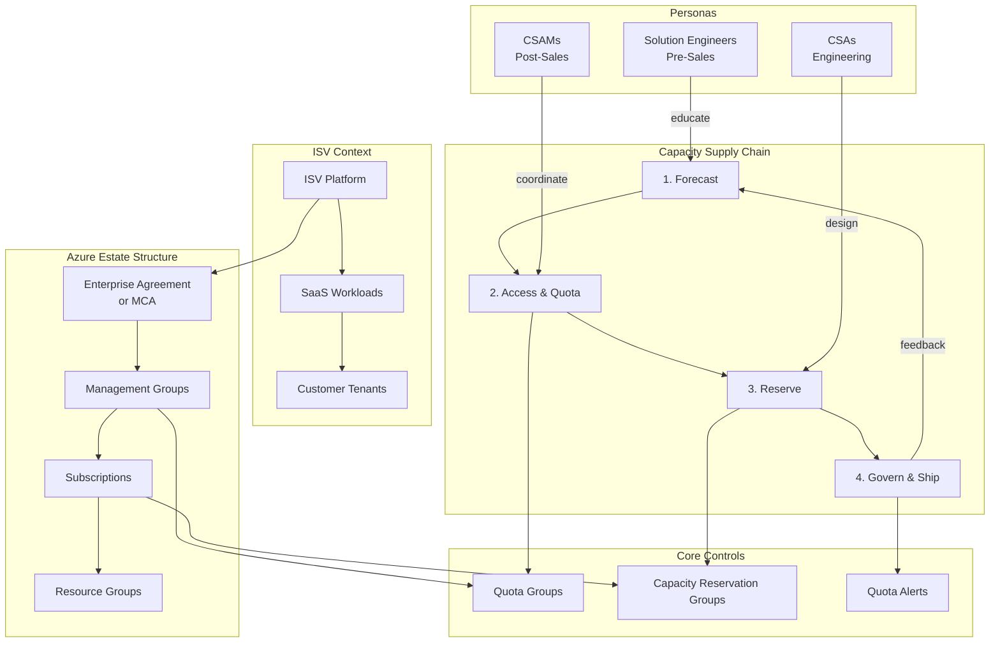
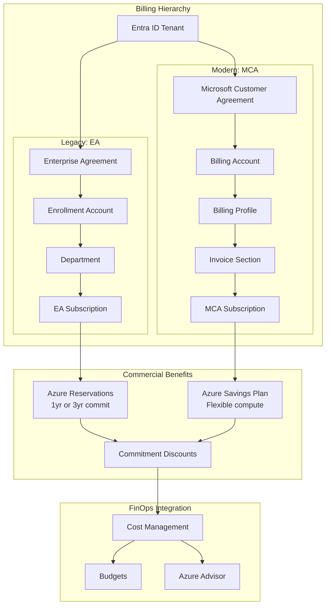
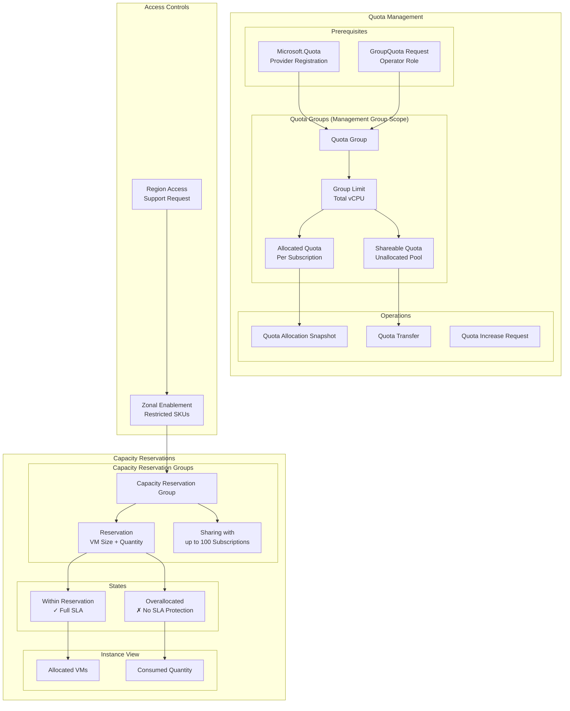
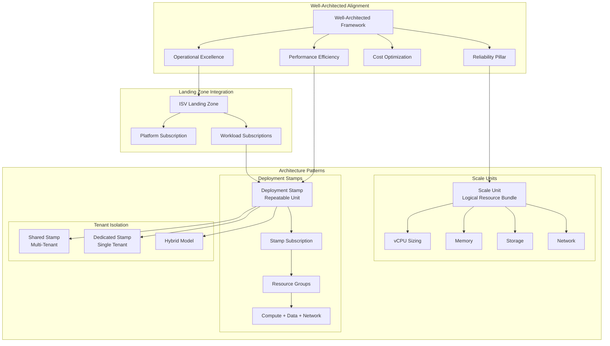
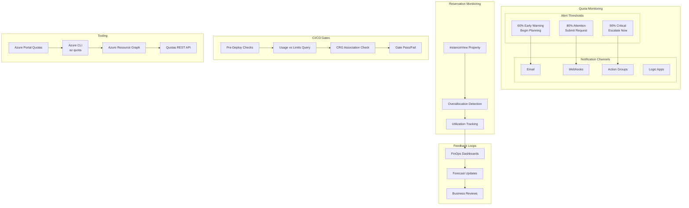
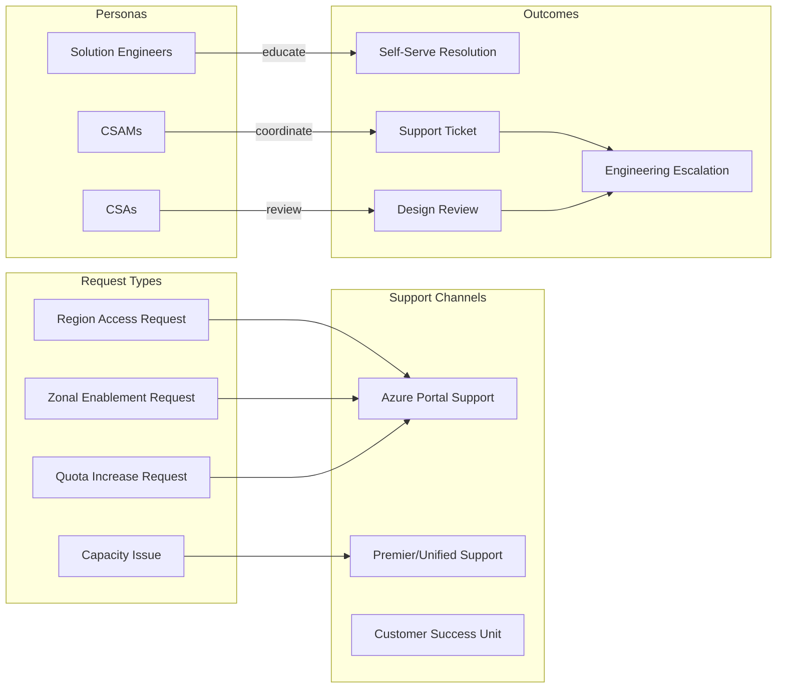
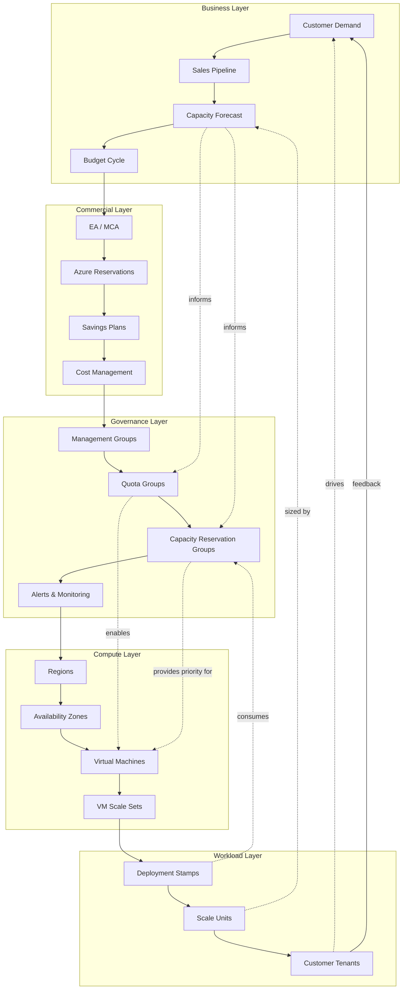

# Azure capacity governance for ISVs – master concept map

This document provides a comprehensive concept map of the entire subject matter covered by the [aka.ms/azcapman](https://aka.ms/azcapman) site.

This view supports both sides of the capacity conversation. The public azcapman site speaks directly to ISV platform teams about Azure estate-level controls and how to manage capacity, quota, and deployment stamps within an ISV landing zone, while this training view also supports Microsoft CSU teams so they can use the same vocabulary, understand the same controls, and know when to partner with customers on quota requests and automation workflows according to [ISV landing zone](https://learn.microsoft.com/en-us/azure/cloud-adoption-framework/ready/landing-zone/isv-landing-zone) and [Well-Architected capacity planning](https://learn.microsoft.com/en-us/azure/well-architected/performance-efficiency/capacity-planning) guidance.

---

## The complete picture

---

## Domain 1: billing and commercial

The financial foundation that determines what capacity levers are available.

---

## Domain 2: operations – quota and capacity

The technical controls for managing compute supply.

---

## Domain 3: deployment patterns

How ISVs structure workloads for multi-tenant SaaS.

---

## Domain 4: monitoring and governance

Observability and release gates for capacity management.

---

## Domain 5: support and escalation

How capacity issues flow through Microsoft support.

---

## The unified view: how it all connects

---

## Concept relationship summary

| Concept | Related Concepts | Primary Documentation |
|---------|-----------------|----------------------|
| **Quota Groups** | Management Group, Subscription, vCPU, Allocation | [Quota groups](https://learn.microsoft.com/en-us/azure/quotas/quota-groups) |
| **Capacity Reservations** | Capacity Reservation Group, VM Size, Availability Zone, Sharing | [Capacity reservation overview](https://learn.microsoft.com/en-us/azure/virtual-machines/capacity-reservation-overview) |
| **ISV Landing Zone** | Enterprise Agreement, Management Group, Subscription, Deployment Stamps | [ISV landing zone](https://learn.microsoft.com/en-us/azure/cloud-adoption-framework/ready/landing-zone/isv-landing-zone) |
| **Deployment Stamps** | Scale Units, Subscription, Resource Group, Tenant Isolation | [Deployment stamps pattern](https://learn.microsoft.com/en-us/azure/architecture/guide/multitenant/approaches/overview#deployment-stamps-pattern) |
| **Scale Units** | vCPU, Memory, Storage, Mission-Critical Architecture | [Scale unit architecture](https://learn.microsoft.com/en-us/azure/well-architected/mission-critical/application-design#scale-unit-architecture) |
| **Workload Supply Chain** | Capacity Planning, Release Gates, Monitoring | [Workload supply chain](https://learn.microsoft.com/en-us/azure/well-architected/operational-excellence/workload-supply-chain) |
| **FinOps** | Cost Management, Reservations, Savings Plans, Rate Optimization | [FinOps rates](https://learn.microsoft.com/en-us/cloud-computing/finops/framework/optimize/rates) |
| **Well-Architected** | Reliability, Performance Efficiency, Cost Optimization, Operational Excellence | [Capacity planning](https://learn.microsoft.com/en-us/azure/well-architected/performance-efficiency/capacity-planning) |

---

## Site structure alignment

| Site Section | Primary Concepts | Key Controls |
|--------------|-----------------|--------------|
| **Billing** (Legacy/Modern) | EA, MCA, Billing Account, Invoice Section | Commercial structure |
| **Operations > Quota** | Quota Groups, vCPU Limits, Allocation | `Microsoft.Quota` provider |
| **Operations > Capacity Reservations** | CRGs, Sharing, Overallocation | Capacity reservation groups |
| **Operations > Monitoring** | Alerts, Thresholds, Action Groups | Azure Monitor |
| **Operations > Automation** | CLI, REST API, GitHub Actions, Azure DevOps | `az quota` commands |
| **Deployment** (Single/Multi-tenant) | Deployment Stamps, Scale Units, Tenant Isolation | ISV landing zone patterns |

---

## Reference links

- [aka.ms/azcapman](https://aka.ms/azcapman) – Complete guides
- [Well-Architected capacity planning](https://learn.microsoft.com/en-us/azure/well-architected/performance-efficiency/capacity-planning)
- [Workload supply chain](https://learn.microsoft.com/en-us/azure/well-architected/operational-excellence/workload-supply-chain)
- [Quota groups](https://learn.microsoft.com/en-us/azure/quotas/quota-groups)
- [Capacity reservation overview](https://learn.microsoft.com/en-us/azure/virtual-machines/capacity-reservation-overview)
- [Capacity reservation group sharing](https://learn.microsoft.com/en-us/azure/virtual-machines/capacity-reservation-group-share)
- [ISV landing zone](https://learn.microsoft.com/en-us/azure/cloud-adoption-framework/ready/landing-zone/isv-landing-zone)
- [Monitoring and alerting](https://learn.microsoft.com/en-us/azure/quotas/how-to-guide-monitoring-alerting)
