# Azure Capacity Governance for ISV Customer Success – Speaker Notes

This document provides concept maps and speaker guidance for each slide in the training deck. Use the Mermaid diagrams to guide discussion flow.

---

## Slide 1 – Title: Azure Capacity Governance for ISV Success

**Duration:** ~30 seconds

### Key points

- Position this as a framework for three personas working together
- Reference [aka.ms/azcapman](https://aka.ms/azcapman) as the self-serve resource
- Set expectation: 13 slides, 20 minutes, actionable takeaways

### Concept map: training scope

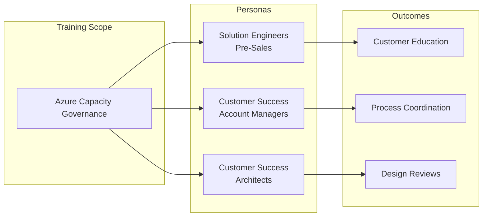

---

## Slide 2 – Three Personas, One Framework

**Duration:** ~1.5 minutes

### Key points

- **SEs (STU)**: Pre-sales, teach customers self-sufficiency to avoid future tickets
- **CSAMs (CSU)**: Post-sales, coordinate process for supported customers
- **CSAs (CSU)**: Post-sales, engineering depth for complex design reviews
- The key distinction: SEs teach to fish; CSU helps fish

### Talk track

> "These three personas engage capacity governance differently. SEs educate during pre-sales to prevent tickets. CSAMs coordinate the journey for supported customers. CSAs step in when technical complexity requires design reviews. Everyone uses the same framework but with different goals."

### Concept map: persona engagement model

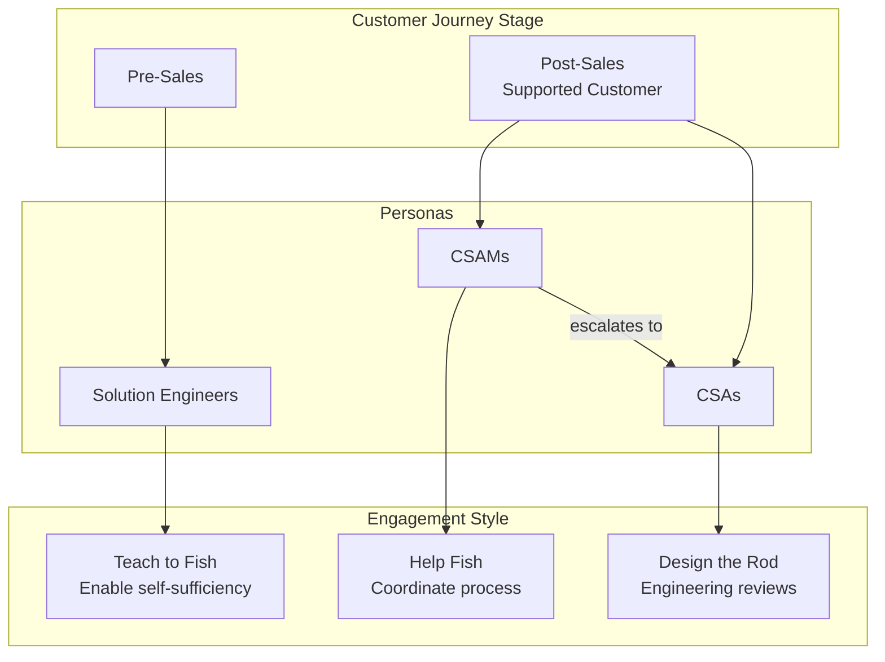

---

## Slide 3 – Why Capacity Governance Matters

**Duration:** ~1.5 minutes

### Key points

- **Blocked onboardings** – Quota exceeded or capacity unavailable delays revenue
- **SLA breaches** – Reserved capacity runs out during surges
- **Noisy Advisor** – Misaligned quota/reservations create confusing recommendations

### Talk track

> "When capacity governance is fragmented, you see three failure modes. Blocked onboardings delay revenue. SLA breaches impact customer trust. Noisy Advisor recommendations trigger reactive procurement instead of planned investments. ISV estates span many subscriptions, zones, and SKUs—requiring coordinated governance."

### Concept map: failure modes and causes

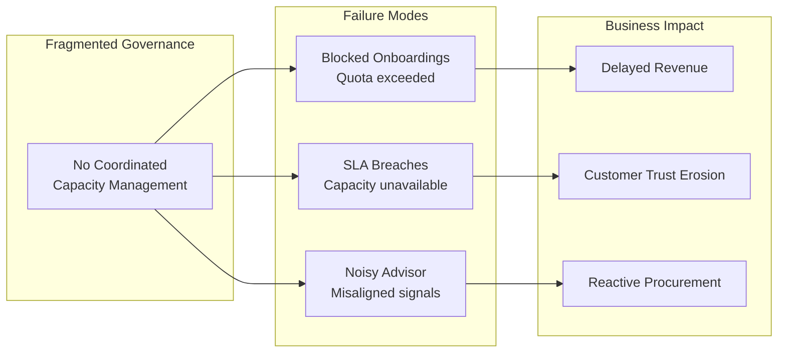

---

## Slide 4 – Capacity Supply Chain Framework Overview

**Duration:** ~2 minutes

### Key points

- Four-phase journey: **Forecast → Access & Quota → Reserve → Govern & Ship**
- Each phase has clear inputs, outputs, and actor responsibilities
- Source: [Well-Architected capacity planning](https://learn.microsoft.com/en-us/azure/well-architected/performance-efficiency/capacity-planning) and [workload supply chain](https://learn.microsoft.com/en-us/azure/well-architected/operational-excellence/workload-supply-chain)

### Talk track

> "The framework follows four phases. Forecast combines business and utilization data. Access and Quota ensures regions are enabled and quota pooled. Reserve locks compute with capacity reservation groups. Govern and Ship adds monitoring and CI/CD gates. Each phase feeds the next."

### Concept map: four-phase journey

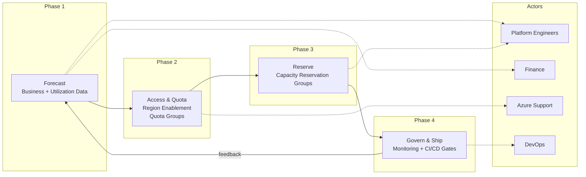

---

## Slide 5 – Building Accurate Capacity Forecasts with Data

**Duration:** ~1.5 minutes

### Key points

- **Data sources**: Azure Monitor telemetry, sales pipeline, Cost Management history
- **Scale unit modeling**: Define what resources comprise one unit, size it, project count
- **Integration**: Align forecasts with budgeting cycles and reservation planning

### Talk track

> "Forecasts need three data sources: utilization telemetry for current patterns, sales pipeline for growth expectations, and Cost Management for historical trends. Model in scale units—define what one unit contains, size it, project how many you need. Then integrate with budgeting cycles."

### Concept map: forecast data flow

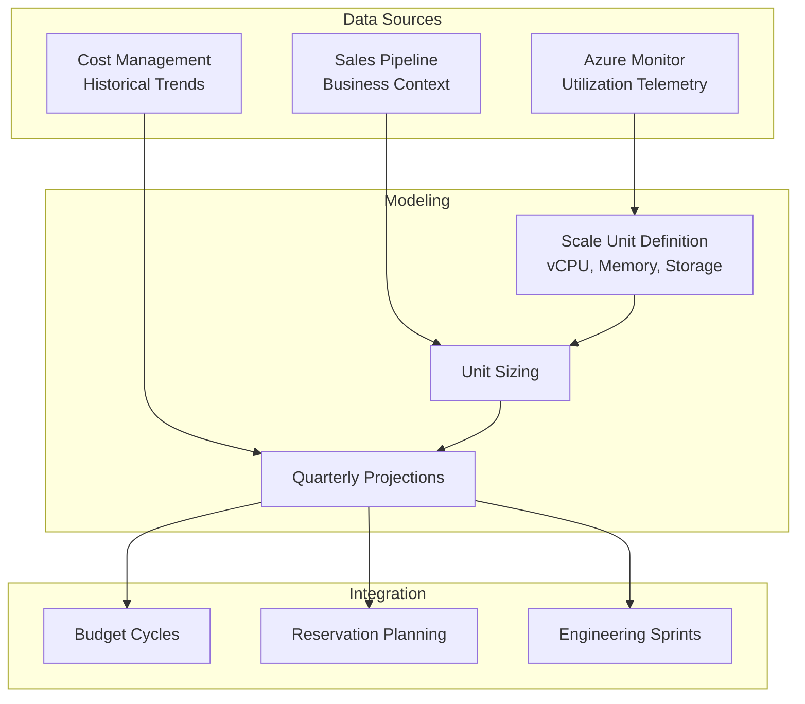

---

## Slide 6 – Phase 2: Access and Quota Controls

**Duration:** ~2 minutes

### Key points

- **Region access**: Explicit enablement via support requests (1-3 business days)
- **Zonal enablement**: Restricted VM series (ND, NC, HB) require separate requests
- **Quota groups**: ARM resources at management group scope for shared vCPU limits
- Prerequisites: `Microsoft.Quota` registration, `GroupQuota Request Operator` role

### Talk track

> "Before deploying, validate region access through support workflows. Zonal enablement for restricted SKUs like ND-series needs separate requests. Then pool quota using quota groups at management group scope. Prerequisites: register Microsoft.Quota and assign GroupQuota Request Operator role."

### Concept map: quota groups architecture

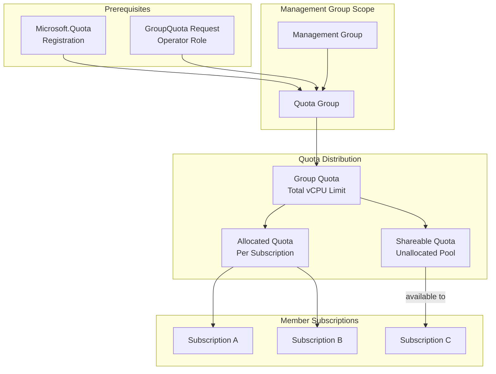

---

## Slide 7 – Phase 3: Capacity Reservations

**Duration:** ~2 minutes

### Key points

- **Capacity reservation groups**: Guarantee compute for specific VM sizes, regions, zones
- **Sharing**: Up to 100 consumer subscriptions can access centrally managed reservations
- **Overallocations**: When demand exceeds reservation quantity, no SLA for excess
- **Timing**: Create 2-4 weeks before major launches

### Talk track

> "Capacity reservations are your insurance policy—they guarantee compute availability. Create groups 2-4 weeks before launches. Share with up to 100 consumer subscriptions so central teams manage procurement while workload teams deploy. Watch for overallocations via instanceView—excess VMs have no SLA guarantee."

### Concept map: capacity reservation sharing

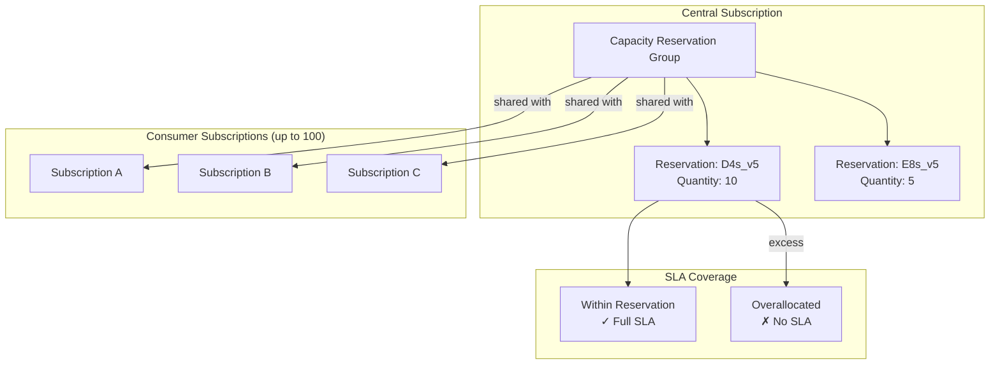

---

## Slide 8 – Phase 4: Govern and Ship

**Duration:** ~1.5 minutes

### Key points

- **Tiered alerts**: 60% early warning, 80% attention, 90% critical
- **Reservation monitoring**: Track instanceView for overallocation warnings
- **CI/CD gates**: Pre-deployment checks query usage vs limits
- **Feedback loops**: Connect alerts to FinOps dashboards and forecast updates

### Talk track

> "Configure tiered alerts at 60%, 80%, and 90% thresholds in the Azure portal Quotas section. Monitor reservation instanceView for overallocations. Add CI/CD gates that check capacity before deployment. Create feedback loops connecting alerts back to forecasts and FinOps dashboards."

### Concept map: monitoring and gates

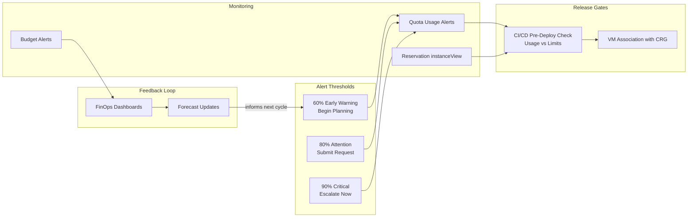

---

## Slide 9 – Common Failure Modes Without Governance

**Duration:** ~1 minute

### Key points

- **Blocked onboardings**: Missing region/zone access or unallocated quota
- **Noisy Advisor**: Misaligned quota, reservations, and usage create confusion
- **Surprise failures**: Bypassing gates consumes unprotected capacity

### Talk track

> "Three common failure modes. Blocked onboardings happen when region access or quota isn't pre-staged. Noisy Advisor recommendations surface when quota and reservations don't match actual usage. Surprise failures occur when deployments bypass gates and consume unprotected capacity that gets reclaimed."

### Concept map: failure modes and prevention

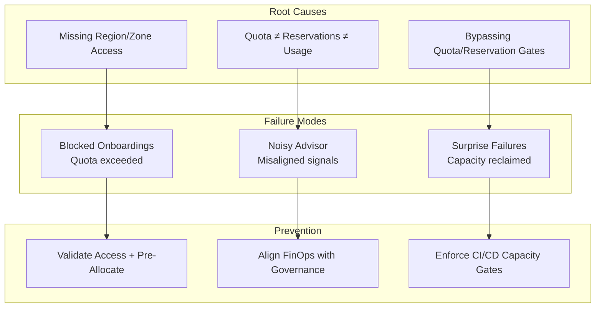

---

## Slide 10 – Spotting Capacity Journey Gaps by Persona

**Duration:** ~1.5 minutes

### Key points

- **Forecast gaps**: No scale unit projections, no telemetry
- **Access/quota blockers**: Support tickets stuck, region-not-enabled errors
- **Reservation gaps**: No CRGs for production, persistent overallocations
- **Monitoring gaps**: No alerts or alerts to unmonitored inboxes

### Talk track

> "Each persona spots gaps differently. Look for forecast gaps—no documented projections or telemetry. Access blockers show up as stuck tickets. Reservation gaps mean no CRGs for production or persistent overallocations. Monitoring gaps appear when alerts go to unmonitored inboxes or don't exist."

### Concept map: gap diagnosis by persona

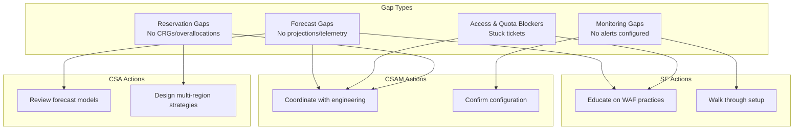

---

## Slide 11 – Qualifying Risk with Targeted Questions

**Duration:** ~2 minutes

### Key points

Three conversation anchors:
1. **Forecast maturity**: "How are you forecasting scale units for next quarter?"
2. **Quota governance**: "Which quota group covers this subscription and what headroom remains?"
3. **Monitoring discipline**: "Which alerts tell you we're 60 days from a crunch?"

### Talk track

> "Use three questions to qualify risk. First, probe forecast maturity—are they modeling scale units or reacting? Second, check quota governance—do they have quota groups with documented headroom? Third, assess monitoring discipline—do tiered alerts exist with defined escalation? Green flags vs red flags tell you where to focus."

### Concept map: qualifying questions

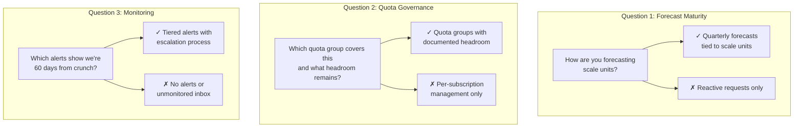

---

## Slide 12 – Collaboration Model and Reference Materials

**Duration:** ~1.5 minutes

### Key points

**Handoff triggers:**
- **SE → CSU**: Customer has support contract and needs hands-on assistance
- **CSAM → CSA**: Technical complexity requires engineering design review

**Self-serve resources at [aka.ms/azcapman](https://aka.ms/azcapman)**

### Talk track

> "Know when to hand off. SEs hand to CSU when the customer has a support contract and needs more than education. CSAMs escalate to CSAs when technical complexity requires design reviews. Everyone shares the azcapman runbooks, quota groups docs, and capacity reservations guides as the single source of truth."

### Concept map: handoff model

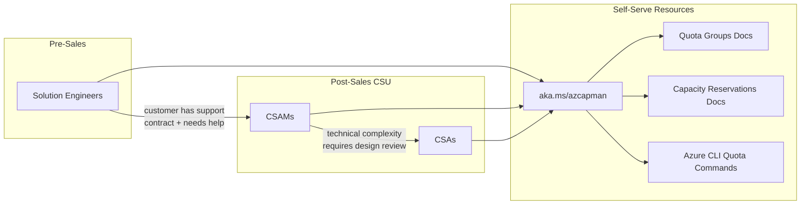

---

## Slide 13 – Key Takeaways and Next Steps

**Duration:** ~1.5 minutes

### Key points

**Four-phase journey recap:**
- Forecast → Access & Quota → Reserve → Govern & Ship

**Persona-specific next steps:**
- **SEs**: Share self-serve resources, educate on journey, identify gaps
- **CSAMs**: Identify current phase per ISV, schedule quota group reviews
- **CSAs**: Confirm reservation checks, review escalation queue

### Talk track

> "Recap: four phases—forecast, access and quota, reserve, govern and ship. Each persona has specific follow-ups. SEs share resources and identify gaps. CSAMs identify which phase each ISV is in and schedule reviews. CSAs confirm reservation utilization and clear their design review queue. Bookmark azcapman for ongoing reference."

### Concept map: persona next steps

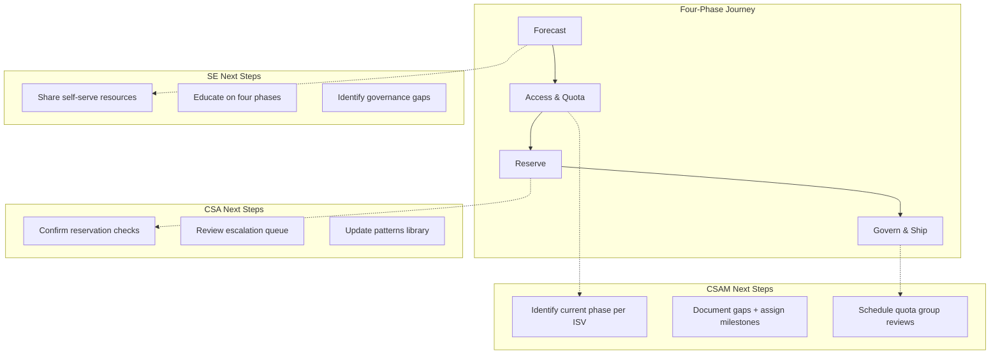

---

## Quick Reference Links

| Resource | URL |
|----------|-----|
| azcapman runbooks | [aka.ms/azcapman](https://aka.ms/azcapman) |
| Capacity planning (WAF) | [learn.microsoft.com/.../capacity-planning](https://learn.microsoft.com/en-us/azure/well-architected/performance-efficiency/capacity-planning) |
| Workload supply chain | [learn.microsoft.com/.../workload-supply-chain](https://learn.microsoft.com/en-us/azure/well-architected/operational-excellence/workload-supply-chain) |
| Quota groups | [learn.microsoft.com/.../quota-groups](https://learn.microsoft.com/en-us/azure/quotas/quota-groups) |
| Capacity reservations | [learn.microsoft.com/.../capacity-reservation-overview](https://learn.microsoft.com/en-us/azure/virtual-machines/capacity-reservation-overview) |
| Capacity reservation sharing | [learn.microsoft.com/.../capacity-reservation-group-share](https://learn.microsoft.com/en-us/azure/virtual-machines/capacity-reservation-group-share) |
| Monitoring and alerting | [learn.microsoft.com/.../how-to-guide-monitoring-alerting](https://learn.microsoft.com/en-us/azure/quotas/how-to-guide-monitoring-alerting) |
| Region access requests | [learn.microsoft.com/.../region-access-request-process](https://learn.microsoft.com/en-us/troubleshoot/azure/general/region-access-request-process) |
| Zonal enablement | [learn.microsoft.com/.../zonal-enablement-request-for-restricted-vm-series](https://learn.microsoft.com/en-us/troubleshoot/azure/general/zonal-enablement-request-for-restricted-vm-series) |
