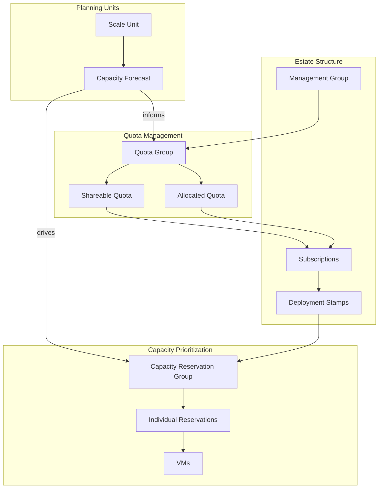

# Module 0 – key terms

## Glossary of capacity governance concepts

Before diving into the four-phase capacity journey, you'll need to understand these core Azure constructs. Each concept plays a specific role in how ISVs manage compute resources across their estates.

### Core concepts

**Quota group**
An [ARM resource at management group scope](https://learn.microsoft.com/en-us/azure/quotas/quota-groups) that pools vCPU limits across multiple subscriptions. Quota groups let central teams allocate and manage quota from a shared pool rather than requesting increases for each subscription individually.

**Capacity reservation group (CRG)**
An [Azure resource](https://learn.microsoft.com/en-us/azure/virtual-machines/capacity-reservation-overview) that provides priority for VM availability for specific sizes, regions, and zones. Reservations lock compute capacity so workloads can deploy without "SkuNotAvailable" failures, and can be [shared across up to 100 consumer subscriptions](https://learn.microsoft.com/en-us/azure/virtual-machines/capacity-reservation-group-share).

**Scale unit**
A logical bundle of compute, storage, and network resources that scales together. Scale units define what resources comprise one repeatable deployment unit—for example, "one scale unit = 16 D4s_v5 VMs, 500 GB premium SSD, and 1 Gbps network egress." ([Well-Architected capacity planning](https://learn.microsoft.com/en-us/azure/well-architected/performance-efficiency/capacity-planning))

**Deployment stamp**
A [repeatable unit of infrastructure](https://learn.microsoft.com/en-us/azure/architecture/guide/multitenant/approaches/overview#deployment-stamps-pattern) serving one or more tenants. ISVs use stamps to isolate customer workloads—stamps can be dedicated (single tenant) or shared (multi-tenant). Each stamp typically contains one or more scale units.

**Shareable quota**
The unallocated portion of a quota group's total limit that's available to any member subscription. For example, if a quota group has 1,000 vCPUs and 600 are explicitly allocated to subscriptions, the remaining 400 vCPUs are shareable. ([Azure quota groups documentation](https://learn.microsoft.com/en-us/azure/quotas/quota-groups))

**Overallocation**
When more VMs are deployed than the capacity reservation quantity covers. The [instanceView property](https://learn.microsoft.com/en-us/azure/virtual-machines/capacity-reservation-overallocate) shows how many VMs exceed the reservation—those excess VMs don't have an SLA for capacity availability.

### Why these concepts matter

**Without quota groups**, you'll request increases per subscription, creating bottlenecks and fragmented visibility.

**Without capacity reservations**, production deployments risk "SkuNotAvailable" errors during surges, especially in constrained regions or for GPU-heavy workloads.

**Without scale units**, forecasts become guesswork—you'll over-provision (wasting money) or under-provision (blocking onboardings).

**Without deployment stamps**, tenant isolation becomes ad-hoc, making it harder to provide priority capacity for high-value customers or to isolate faults.

### Quick reference

| Concept | Scope | Purpose | Source |
|---------|-------|---------|--------|
| Quota group | Management group | Pool vCPU limits across subscriptions | [Quota groups](https://learn.microsoft.com/en-us/azure/quotas/quota-groups) |
| Capacity reservation group | Subscription + region + zone | Provide priority for VM availability | [Capacity reservation overview](https://learn.microsoft.com/en-us/azure/virtual-machines/capacity-reservation-overview) |
| Scale unit | Logical model | Define repeatable deployment bundle | [Capacity planning (WAF)](https://learn.microsoft.com/en-us/azure/well-architected/performance-efficiency/capacity-planning) |
| Deployment stamp | Architecture pattern | Isolate tenants with repeatable infrastructure | [Deployment stamps pattern](https://learn.microsoft.com/en-us/azure/architecture/guide/multitenant/approaches/overview#deployment-stamps-pattern) |
| Shareable quota | Quota group | Unallocated vCPUs available to any member subscription | [Quota groups](https://learn.microsoft.com/en-us/azure/quotas/quota-groups) |

---

## Concept map: how terms relate

---

## Next steps

With these terms defined, you're ready to explore the four-phase capacity journey: **Forecast → Access & Quota → Reserve → Govern & Ship**.
