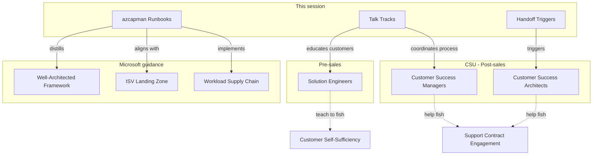

# Slide 1 – title and welcome

## Azure capacity governance for ISV customer success

Welcome to this 20-minute briefing on Azure capacity governance. This session distills the [azcapman runbooks](https://aka.ms/azcapman) into a consistent framework for three key personas who engage with ISV partners on capacity topics.

### Target audience

| Persona | Stage | Role | Approach |
|---------|-------|------|----------|
| **Solution Engineers (SEs)** | Pre-sales | Technical architects educating customers on capacity governance | Teach customers to fish—build self-sufficiency and avoid tickets |
| **Customer Success Managers (CSMs)** | Post-sales (CSU) | Coordinators for customers with support contracts | Help customers fish—hands-on process coordination |
| **Customer Success Architects (CSAs)** | Post-sales (CSU) | Technical architects for customers with support contracts | Help customers fish—engineering design reviews |

**Key distinction:** SEs help customers avoid needing support. CSU (CSMs and CSAs) works with customers who have support contracts and can actively assist with the process.

### What you'll learn

This content aligns with three foundational guidance sets:

- [Well-Architected capacity planning](https://learn.microsoft.com/en-us/azure/well-architected/performance-efficiency/capacity-planning) for forecasting and performance
- [ISV landing zone](https://learn.microsoft.com/en-us/azure/cloud-adoption-framework/ready/landing-zone/isv-landing-zone) for estate structure and governance
- [Workload supply chain](https://learn.microsoft.com/en-us/azure/well-architected/operational-excellence/workload-supply-chain) for release gates and operational excellence

### Session format

This deck provides:

1. **Talk tracks** – Questions and conversation anchors for customer engagements
2. **Handoff triggers** – Clear criteria for when CSMs should engage CSAs
3. **Reference links** – Direct access to runbooks and documentation for self-serve follow-up

The goal is to give everyone a shared vocabulary and clear role boundaries.

---

## Concept map: training foundations

