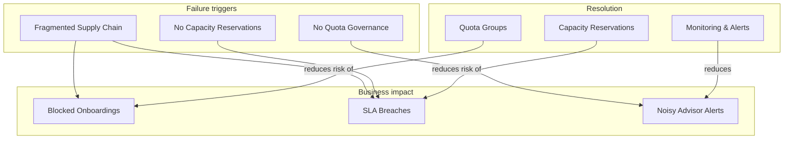

# Slide 2 – why this session matters

## The cost of fragmented capacity management

Capacity failures don't only cause technical outages—they erode customer trust and create escalation loops that consume CSU bandwidth.

### Business impact of capacity gaps

| Failure mode | Business consequence |
|-------------|---------------------|
| Blocked onboardings | New tenant stamps can't deploy, delaying revenue recognition |
| SLA breaches | Workloads degrade when reserved capacity runs out |
| Noisy Advisor alerts | Misaligned quota and reservations trigger reactive procurement cycles |

When the [workload supply chain](https://learn.microsoft.com/en-us/azure/well-architected/operational-excellence/workload-supply-chain) is fragmented, these failures cascade. The [FinOps rate optimization framework](https://learn.microsoft.com/en-us/cloud-computing/finops/framework/optimize/rates#getting-started) becomes difficult to implement when utilization data is scattered across teams.

### ISV estate complexity

ISV platforms typically span:

- **Multiple subscriptions** – Often organized by tenant, environment, or region
- **Multiple availability zones** – For reliability and compliance requirements
- **Multiple VM SKUs** – Different workload types require different compute families

Without coordinated governance through [quota groups](https://learn.microsoft.com/en-us/azure/quotas/quota-groups) and [capacity reservations](https://learn.microsoft.com/en-us/azure/virtual-machines/capacity-reservation-overview), each subscription operates as an island, leading to stranded vCPU inventory and manual escalations.

### Why this training matters for each persona

**Solution Engineers (pre-sales):** Capacity failures during proof-of-concept or early adoption create negative impressions that are hard to overcome. Educating customers on governance before they go live reduces the risk of these issues.

**CSMs (CSU):** Customer success teams often triage capacity escalations before engineering gets involved. A shared framework shortens time-to-resolution and enables proactive identification of at-risk accounts.

**CSAs (CSU):** Complex capacity issues require engineering depth. Understanding the governance framework ensures CSAs can step in efficiently when CSMs escalate.

---

## Concept map: capacity failure cascade

