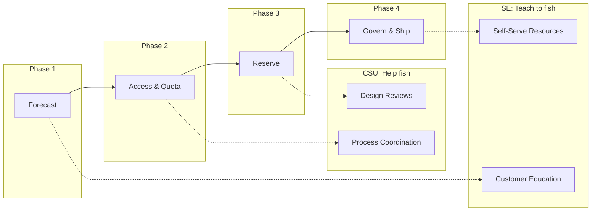

# Slide 3 – agenda and outcomes

## Session structure: the capacity journey

This session follows the four-phase capacity journey from [Well-Architected capacity planning](https://learn.microsoft.com/en-us/azure/well-architected/performance-efficiency/capacity-planning) and [workload supply chain](https://learn.microsoft.com/en-us/azure/well-architected/operational-excellence/workload-supply-chain) guidance:

| Phase | Focus | Slides | Estimated time |
|-------|-------|--------|----------------|
| **Glossary** | Key term definitions | Module 0 | 5 min (self-study) |
| **Forecast** | Data, models, and business context | 1 | 8-12 min |
| **Access & Quota** | Region access, zonal enablement, quota groups | 2 | 15-20 min |
| **Reserve** | Capacity reservations and sharing mechanics | 2 | 12-15 min |
| **Govern & Ship** | Monitoring, alerting, and release gates | 2 | 10-15 min |

**Total**: 13 slides, 60-75 minutes depending on discussion depth. Times are estimates—adjust based on your audience's familiarity with Azure capacity constructs.

### What you'll be able to do after this session

**For Solution Engineers (pre-sales):**
- Diagnose which phase of the capacity journey a customer is stuck in using three qualifying questions
- Explain the difference between quota groups and capacity reservations to non-technical stakeholders
- Identify governance gaps that'll create future support tickets

**For Customer Success Managers (CSU):**
- Assess capacity governance maturity using forecast, quota, and monitoring readiness indicators
- Coordinate cross-team capacity planning for customers with support contracts
- Recognize when technical complexity requires CSA escalation

**For Customer Success Architects (CSU):**
- Review scale unit forecasting models for accuracy and alignment with business growth
- Design multi-region capacity strategies that balance cost and availability
- Validate quota group and capacity reservation configurations for production readiness

### Supporting resources

- Content to educate customers on capacity governance during sales cycles
- Self-serve resources customers can use to avoid support tickets
- Architecture patterns that prevent capacity problems before they occur

**For Customer Success Managers (CSU):**
- Decision levers for each phase of the capacity journey
- Risk indicators that signal when to escalate to CSAs
- Process coordination guidance for customers with support contracts

**For Customer Success Architects (CSU):**
- [Azure CLI quota commands](https://learn.microsoft.com/en-us/cli/azure/quota?view=azure-cli-latest) for baseline analysis
- Links to [quota operations guides](https://learn.microsoft.com/en-us/azure/quotas/regional-quota-requests)
- Design review frameworks for complex capacity strategies

### Role clarity

| Persona | Primary focus | Handoff trigger |
|---------|--------------|-----------------|
| **Solution Engineers** | Educate on self-service, prevent future tickets | Customer needs hands-on support → CSU |
| **Customer Success Managers** | Coordinate capacity process for supported customers | Technical complexity → CSA |
| **Customer Success Architects** | Engineering design reviews for supported customers | — |

---

## Concept map: session journey

