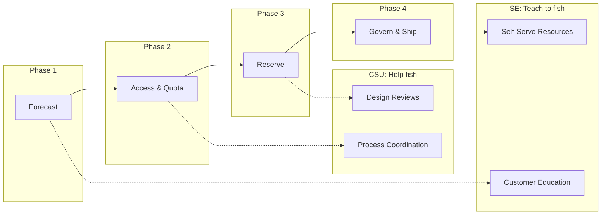

# Slide 3 – agenda and outcomes

## Session structure: the capacity journey

This session follows the four-phase capacity journey from [Well-Architected capacity planning](https://learn.microsoft.com/en-us/azure/well-architected/performance-efficiency/capacity-planning) and [workload supply chain](https://learn.microsoft.com/en-us/azure/well-architected/operational-excellence/workload-supply-chain) guidance:

| Phase | Focus | Time |
|-------|-------|------|
| **Forecast** | Data, models, and business context | 3 min |
| **Access & Quota** | Region access, zonal enablement, quota groups | 5 min |
| **Reserve** | Capacity reservations and sharing mechanics | 4 min |
| **Govern & Ship** | Monitoring, alerting, and release gates | 4 min |

### What you'll take away

**For Solution Engineers (pre-sales):**
- Content to educate customers on capacity governance during sales cycles
- Self-serve resources customers can use to avoid support tickets
- Architecture patterns that prevent capacity problems before they occur

**For Customer Success Managers (CSU):**
- Decision levers for each phase of the capacity journey
- Risk indicators that signal when to escalate to CSAs
- Process coordination guidance for customers with support contracts

**For Customer Success Architects (CSU):**
- [Azure CLI quota commands](https://learn.microsoft.com/en-us/cli/azure/quota?view=azure-cli-latest) for baseline analysis
- Links to [quota operations runbooks](https://learn.microsoft.com/en-us/azure/quotas/regional-quota-requests)
- Design review frameworks for complex capacity strategies

### Role clarity

| Persona | Primary focus | Handoff trigger |
|---------|--------------|-----------------|
| **Solution Engineers** | Educate on self-service, prevent future tickets | Customer needs hands-on support → CSU |
| **Customer Success Managers** | Coordinate capacity process for supported customers | Technical complexity → CSA |
| **Customer Success Architects** | Engineering design reviews for supported customers | — |

---

## Concept map: session journey

