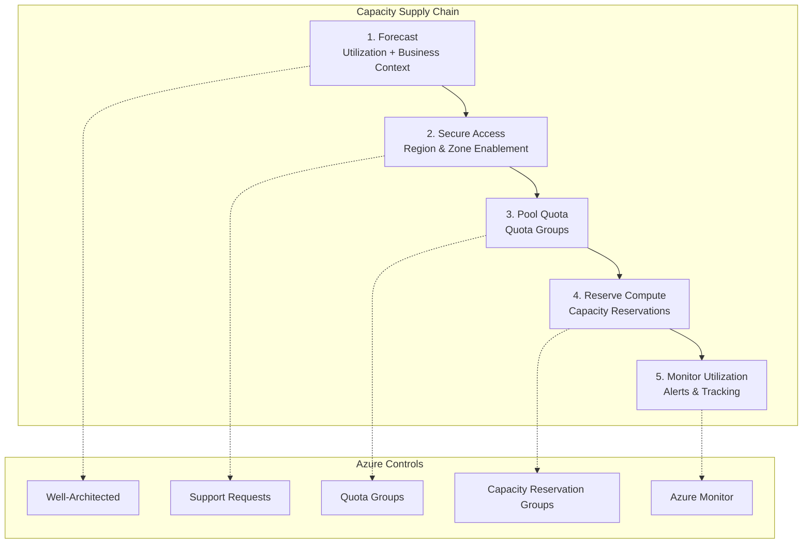

# Slide 4 – Azure capacity governance at a glance

## The five-step capacity supply chain

The capacity governance program defines five steps that map directly to Azure controls and [azcapman runbooks](https://aka.ms/azcapman):

| Step | Control | Runbook reference |
|------|---------|------------------|
| 1. **Forecast** | Utilization telemetry + business context | [Capacity planning](https://learn.microsoft.com/en-us/azure/well-architected/performance-efficiency/capacity-planning) |
| 2. **Secure access** | Region and zone enablement | Region access workflows |
| 3. **Pool quota** | Quota groups at management group scope | [Quota groups](https://learn.microsoft.com/en-us/azure/quotas/quota-groups) |
| 4. **Reserve compute** | Capacity reservation groups | [Capacity reservations](https://learn.microsoft.com/en-us/azure/virtual-machines/capacity-reservation-overview) |
| 5. **Monitor utilization** | Usage alerts and budget tracking | [Monitoring and alerting](https://learn.microsoft.com/en-us/azure/quotas/how-to-guide-monitoring-alerting) |

### First-party documentation backing

Every lever in the capacity governance program has corresponding Microsoft documentation:

- **Quota groups** – ARM resources for sharing vCPU limits across subscriptions
- **Capacity reservations** – Guaranteed compute availability for specific VM sizes
- **Monitoring** – Native Azure Monitor integration for quota and reservation utilization

This means you can reference official docs during ISV conversations rather than relying solely on internal guidance.

### Quick reference: azcapman

The [azcapman site](https://aka.ms/azcapman) consolidates:

- Step-by-step runbooks for each phase
- Scripts and CLI commands for automation
- Architecture patterns for ISV capacity governance

---

## Concept map: five-step supply chain

