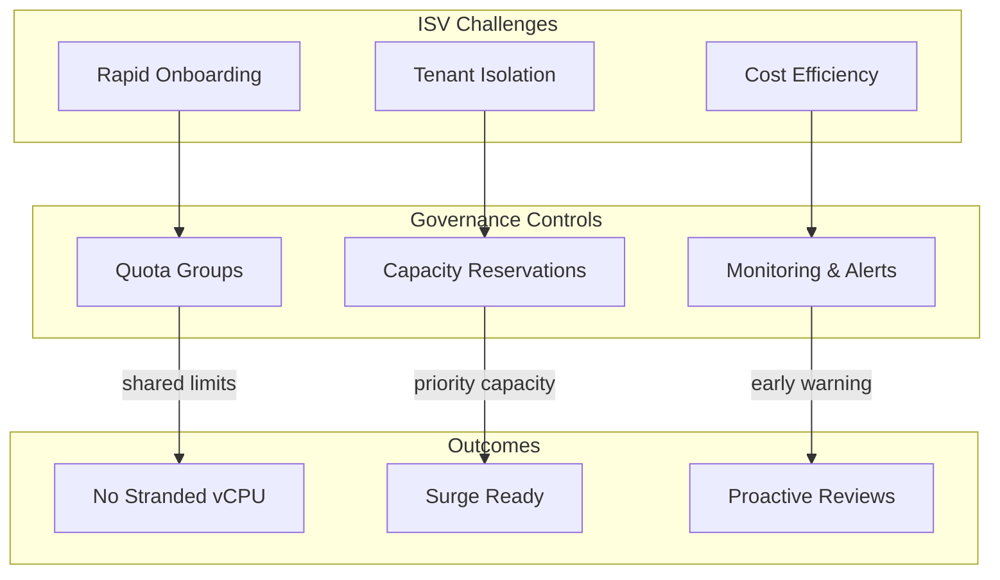

# Slide 5 – why governance matters for ISVs

## The ISV capacity challenge

ISV platforms face a unique tension: they must onboard customers rapidly while maintaining tenant isolation and cost efficiency. Without governance, this leads to:

- **Stranded vCPU inventory** – Quota allocated to subscriptions that don't use it
- **Capacity failures during surges** – Critical SKUs unavailable when demand spikes
- **Reactive escalations** – Last-minute support tickets instead of planned procurement

### How quota groups reduce stranded inventory

[Quota groups](https://learn.microsoft.com/en-us/azure/quotas/quota-groups) let ISVs share vCPU limits across subscriptions under a management group. This means:

- Quota allocated at the group level can be consumed by any member subscription
- Unused capacity in one subscription is available to others
- Central teams can monitor aggregate utilization rather than per-subscription fragmentation

### How capacity reservations preserve customer experience

[Capacity reservations](https://learn.microsoft.com/en-us/azure/virtual-machines/capacity-reservation-overview) provide priority for compute availability for specific VM sizes, regions, and availability zones. During regional supply constraints:

- Reserved capacity improves availability for your workloads
- Critical SKUs can be locked in advance of major launches
- Reservations can be shared with up to 100 consumer subscriptions

### How coordinated monitoring enables proactive reviews

[Quota monitoring and alerting](https://learn.microsoft.com/en-us/azure/quotas/how-to-guide-monitoring-alerting) provides early warning on capacity saturation:

- Set alerts at 60%, 80%, and 90% utilization thresholds
- Integrate with budget alerts for holistic financial governance
- Use data in business reviews with tenants to demonstrate capacity planning

---

## Concept map: ISV governance benefits

