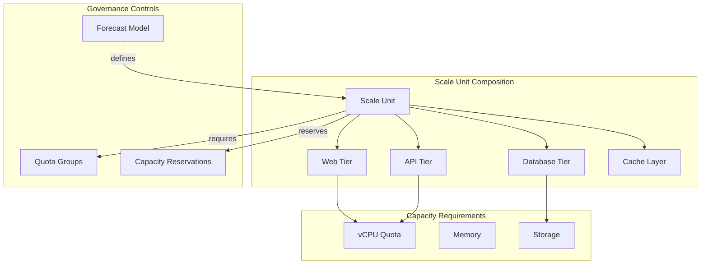

# Slide 6 – Azure's view of capacity (scale units)

## Understanding scale units

A scale unit is a logical bundle of resources that scale together as a single unit. The [mission-critical design guidance](https://learn.microsoft.com/en-us/azure/well-architected/mission-critical/application-design#scale-unit-architecture) recommends scale units to standardize deployments and simplify capacity planning.

### Why scale units matter for capacity governance

Scale units provide:

- **Predictable resource envelopes** – Each unit has known vCPU, memory, and storage requirements
- **Consistent scaling increments** – Add capacity in discrete, well-understood chunks
- **Traceable forecasts** – Business growth maps directly to scale unit additions

### Well-Architected scaling guidance

The [reliability pillar's scaling guidance](https://learn.microsoft.com/en-us/azure/well-architected/reliability/scaling#choose-appropriate-scale-units) encourages scaling at three layers:

| Layer | Example | Scaling approach |
|-------|---------|-----------------|
| **Service** | Single VM or container | Vertical scaling (resize) |
| **Component** | Web tier or database tier | Horizontal scaling (add instances) |
| **Solution** | Complete deployment stamp | Scale unit addition |

### Connecting scale units to quota planning

When ISVs define scale units, they can:

1. Calculate the total vCPU requirement per unit
2. Forecast the number of units needed for growth
3. Request quota and reservations based on concrete numbers

This makes engineering requests traceable to business growth and simplifies [capacity planning](https://learn.microsoft.com/en-us/azure/well-architected/performance-efficiency/capacity-planning) conversations.

---

## Concept map: scale unit architecture

