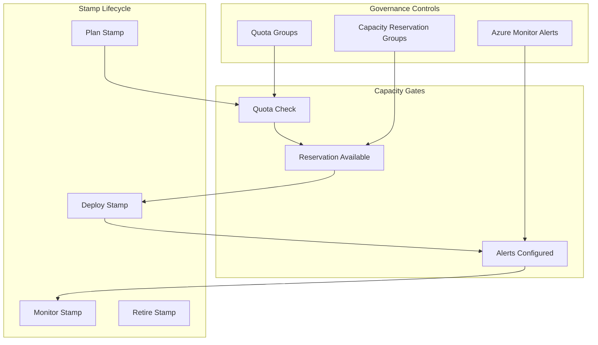

# Slide 7 – deployment stamps and supply chain

## Deployment stamps for multi-tenant SaaS

A [deployment stamp](https://learn.microsoft.com/en-us/azure/architecture/guide/multitenant/approaches/overview#deployment-stamps-pattern) is a repeatable deployment unit that contains all resources needed to serve a set of tenants. Stamps align operationally with scale units and provide a concrete target for capacity governance.

### Stamp characteristics

| Attribute | Description |
|-----------|-------------|
| **Self-contained** | Each stamp includes compute, storage, networking, and any shared services |
| **Repeatable** | Stamps are deployed from templates with consistent configurations |
| **Isolated** | Tenant data and workloads are separated by stamp or within-stamp boundaries |
| **Scalable** | Add stamps to increase capacity rather than resizing individual resources |

### Why stamps require coordinated governance

Each stamp deployment requires:

- **Quota** – Sufficient vCPU allocation in the target region and zone via [quota groups](https://learn.microsoft.com/en-us/azure/quotas/quota-groups)
- **Reservations** – Guaranteed compute availability through [capacity reservations](https://learn.microsoft.com/en-us/azure/virtual-machines/capacity-reservation-overview)
- **Monitoring** – Utilization tracking to forecast when the next stamp is needed

Without coordination, each stamp deployment becomes an ad-hoc escalation.

### Supply chain gates for stamp deployments

The [workload supply chain](https://learn.microsoft.com/en-us/azure/well-architected/operational-excellence/workload-supply-chain) guidance expects environment promotions to pass capacity gates before release:

1. **Pre-deployment** – Verify quota headroom and reservation availability
2. **Deployment** – Associate VMs with capacity reservation groups
3. **Post-deployment** – Confirm utilization alerts are configured

---

## Concept map: deployment stamps in the supply chain

