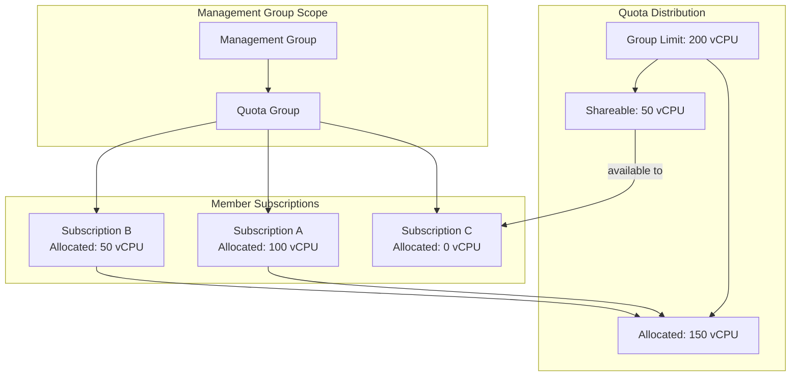

# Slide 8 – quota groups in the supply chain

## What are quota groups?

[Quota groups](https://learn.microsoft.com/en-us/azure/quotas/quota-groups) are ARM resources at the management group scope that let ISVs share vCPU limits across multiple subscriptions. Instead of managing quota per-subscription, central teams can allocate and monitor capacity at the group level.

### How quota groups work

| Concept | Description |
|---------|-------------|
| **Group quota** | Total vCPU limit shared across all member subscriptions |
| **Allocated quota** | Portion assigned to specific subscriptions within the group |
| **Shareable quota** | Unallocated capacity available to any member subscription |

### Prerequisites for quota groups

Before creating quota groups, ensure:

1. **Resource provider registration** – Register `Microsoft.Quota` on subscriptions that will participate
2. **Role assignment** – Grant the `GroupQuota Request Operator` role to identities managing quota
3. **Management group structure** – Quota groups scope to management groups, so your hierarchy must support the sharing boundary

### Quota allocation snapshots

The [quota allocation snapshot](https://learn.microsoft.com/en-us/azure/quotas/transfer-quota-groups#quota-allocation-snapshot) reveals:

- Current allocated quota per subscription
- Shareable headroom at the group level
- Stranded cores that could be reallocated

Use snapshots during business reviews to identify optimization opportunities and justify quota increase requests.

### Transferring quota within groups

Quota can be transferred between subscriptions in the same group without support tickets:

1. Reduce allocation on the source subscription
2. Increase allocation on the target subscription
3. Total stays within the group limit

---

## Concept map: quota groups architecture

