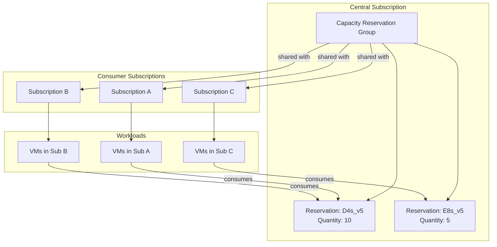

# Slide 9 – capacity reservations in practice

## What are capacity reservations?

[Capacity reservations](https://learn.microsoft.com/en-us/azure/virtual-machines/capacity-reservation-overview) provide priority for compute availability for specific VM sizes in specific regions and availability zones. When you create a reservation, Azure sets aside the requested capacity exclusively for your use.

### Capacity reservation groups

Reservations are organized into capacity reservation groups (CRGs), which:

- Contain one or more reservations for different VM sizes
- Scope to a single region but can span availability zones
- Can be shared with up to 100 consumer subscriptions

### How sharing works

[Capacity reservation group sharing](https://learn.microsoft.com/en-us/azure/virtual-machines/capacity-reservation-group-share) enables central teams to:

1. Create and manage reservations in a central subscription
2. Share the CRG with consumer subscriptions across the tenant
3. Let workload teams deploy VMs that consume the reserved capacity

This centralizes procurement while distributing deployment authority.

#### Scaling beyond 100 subscriptions

[Capacity reservation groups support up to 100 consumer subscriptions](https://learn.microsoft.com/en-us/azure/virtual-machines/capacity-reservation-group-share#limitations-of-sharing-a-capacity-reservation-group). For larger ISV estates:

- **Multiple CRGs**: Create separate CRGs for different subscription cohorts (by region, customer tier, or workload type)
- **Hub-and-spoke**: Central platform subscription owns CRGs; workload subscriptions consume via sharing
- **Regional distribution**: Each region gets its own CRG, naturally partitioning the subscription count

Plan your CRG architecture early—retrofitting after hitting the 100-subscription limit requires careful migration.

### Understanding overallocations

When more VMs are associated with a reservation than its quantity supports, you have an [overallocation](https://learn.microsoft.com/en-us/azure/virtual-machines/capacity-reservation-overallocate):

| State | SLA coverage | Action required |
|-------|-------------|-----------------|
| **Within reservation** | Full SLA | None |
| **Overallocated** | No SLA protection | Increase reservation or reduce VMs |

Check the `instanceView` property of the reservation to detect overallocations before they cause deployment failures.

### When to use capacity reservations

Use reservations when:

- Deploying mission-critical workloads that can't tolerate capacity failures
- Planning major launches or migrations with known compute requirements
- Operating in regions or zones with historically tight supply

---

## Concept map: capacity reservation mechanics

