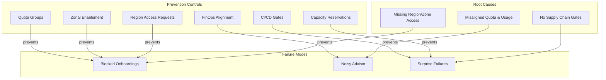

# Slide 10 – what fails without a supply-chain view

## Common failure modes

When capacity governance is fragmented, ISV platforms encounter predictable failure patterns. Understanding these helps all personas add value:

| Persona | Value-add |
|---------|-----------|
| **Solution Engineers** | Educate customers on prevention during pre-sales; set expectations for governance investment |
| **Customer Success Managers** | Diagnose issues quickly; coordinate remediation for supported customers |
| **Customer Success Architects** | Design solutions to prevent recurrence; review architecture for gaps |

### Blocked onboardings

**Symptom:** New tenant stamps fail to deploy with "quota exceeded" or "capacity not available" errors.

**Root cause:** Region or zone access is missing, or quota hasn't been allocated to the target subscription.

**Prevention:**
- Validate [region access](https://learn.microsoft.com/en-us/troubleshoot/azure/general/region-access-request-process) before planning deployments
- Submit [zonal enablement requests](https://learn.microsoft.com/en-us/troubleshoot/azure/general/zonal-enablement-request-for-restricted-vm-series) for restricted VM series
- Pre-allocate quota through quota groups before stamp deployment

### Noisy Advisor recommendations

**Symptom:** Azure Advisor surfaces savings-plan or reservation purchase recommendations that don't align with actual needs.

**Root cause:** Quota, capacity reservations, and actual usage are misaligned, creating confusing signals.

**Prevention:**
- Align [FinOps rate optimization](https://learn.microsoft.com/en-us/cloud-computing/finops/framework/optimize/rates#getting-started) with capacity governance
- Correlate Advisor recommendations with quota group utilization data
- Establish a cadence for reviewing recommendations against known capacity plans

### Surprise capacity failures

**Symptom:** Deployments that worked yesterday fail today with capacity errors.

**Root cause:** Deployments bypass quota or reservation gates, consuming unprotected capacity that may be reclaimed.

**Prevention:**
- Implement [workload supply chain](https://learn.microsoft.com/en-us/azure/well-architected/operational-excellence/workload-supply-chain) gates in CI/CD
- Associate all production VMs with capacity reservation groups
- Monitor reservation `instanceView` for overallocation warnings

---

## Concept map: failure modes and prevention

