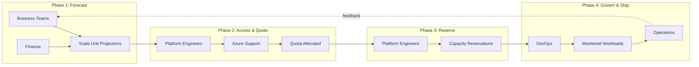

# Slide 11 – Azure capacity journey overview

## The four-phase journey

The capacity journey provides a structured approach to Azure capacity governance. Each phase has clear inputs, outputs, and actor responsibilities.

### Journey phases

| Phase | Input | Output | Primary actors |
|-------|-------|--------|---------------|
| **Forecast** | Business plans, utilization data | Scale unit projections | Platform engineers, Finance |
| **Access & Quota** | Projections, target regions | Enabled regions, allocated quota | Platform engineers, Support |
| **Reserve** | Quota, deployment schedule | Capacity reservation groups | Platform engineers |
| **Govern & Ship** | Reservations, CI/CD pipelines | Monitored deployments | Platform engineers, DevOps |

### Actor handoffs

The journey requires coordination across roles:

1. **Business → Engineering:** Growth forecasts inform scale unit projections
2. **Engineering → Support:** Quota and access requests flow through support workflows
3. **Engineering → DevOps:** Reservation configurations integrate with deployment pipelines
4. **DevOps → Operations:** Monitoring and alerting close the feedback loop

### How each persona engages with the journey

| Persona | Engagement model | Primary phases |
|---------|-----------------|----------------|
| **Solution Engineers** | Educate customers on the full journey during pre-sales | All phases—teach self-sufficiency |
| **Customer Success Managers** | Coordinate progress for supported customers | All phases—track status, identify gaps |
| **Customer Success Architects** | Provide engineering depth when CSMs escalate | Reserve, Govern & Ship—design reviews |

### Documenting the journey

For supported customers, CSMs should document:

- Current phase in the journey
- Known blockers or gaps
- Next milestone and owner

For pre-sales engagements, SEs should ensure customers understand:

- What each phase requires
- How to self-serve through each phase
- When to engage support (and what level of support they'll need)

This makes capacity status visible during business reviews and executive check-ins.

**Reference:** [Capacity planning](https://learn.microsoft.com/en-us/azure/well-architected/performance-efficiency/capacity-planning) | [Workload supply chain](https://learn.microsoft.com/en-us/azure/well-architected/operational-excellence/workload-supply-chain)

---

## Concept map: capacity journey actors

