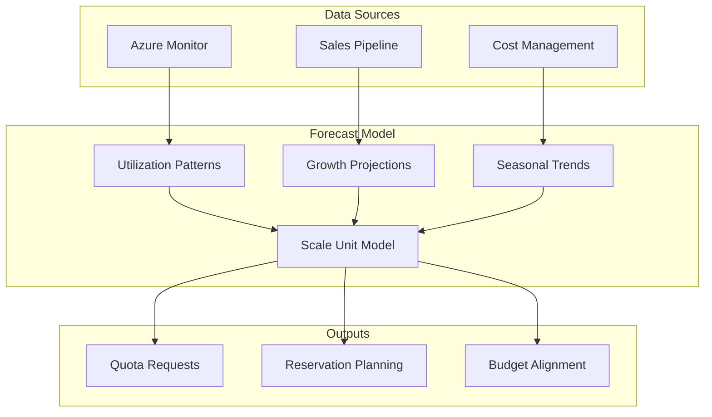

# Slide 12 – forecast: data and models

## Building accurate capacity forecasts

The [Well-Architected capacity planning guidance](https://learn.microsoft.com/en-us/azure/well-architected/performance-efficiency/capacity-planning) emphasizes combining utilization telemetry with business context for accurate forecasts.

### Data sources for forecasting

| Data type | Source | Use case |
|-----------|--------|----------|
| **Utilization telemetry** | Azure Monitor, Log Analytics | Current resource consumption patterns |
| **Business context** | Sales pipeline, customer contracts | Growth expectations and timing |
| **Historical trends** | Cost Management, Resource Graph | Seasonal patterns and growth rates |

> **Purchase 80% of recommendations, not 100%**
>
> Reservation recommendations maximize theoretical savings assuming your usage continues exactly as measured. Reality: usage varies.
>
> Practitioner heuristic from FinOps Toolkit ($3B/year Azure experience):
> - Review the usage breakdown chart via **See details** on any recommendation
> - Consider purchasing 80% of the recommended quantity rather than 100%
> - Monitor utilization monthly; reservations break even at ~60% utilization vs PAYG
>
> [Reservation recommendations are calculated](https://learn.microsoft.com/en-us/azure/cost-management-billing/reservations/reserved-instance-purchase-recommendations) from 7, 30, and 60-day trailing usage. They don't know about customer churn, planned migrations, or architecture changes.

### Modeling with scale units

Even for greenfield workloads, model capacity in terms of scale units or [deployment stamps](https://learn.microsoft.com/en-us/azure/architecture/guide/multitenant/approaches/overview#deployment-stamps-pattern):

1. **Define the unit** – What resources comprise one scale unit?
2. **Size the unit** – How many vCPUs, storage, network throughput?
3. **Project demand** – How many units needed per quarter?

This creates a concrete envelope for quota and reservation planning.

### Embedding forecasts in planning cycles

Capacity forecasts should integrate with:

- **Budgeting cycles** – Align capacity procurement with financial planning
- **Reservation planning** – Match Azure Savings Plans and Reserved Instances to projected usage
- **Engineering sprints** – Include capacity work in regular development cycles

### Forecast review cadence

| Frequency | Focus | Participants |
|-----------|-------|--------------|
| **Weekly** | Utilization trends, alert review | Platform engineers |
| **Monthly** | Scale unit projections, quota status | Engineering + Finance |
| **Quarterly** | Business alignment, reservation purchases | Executive + Engineering |

---

## Concept map: forecasting data flow

