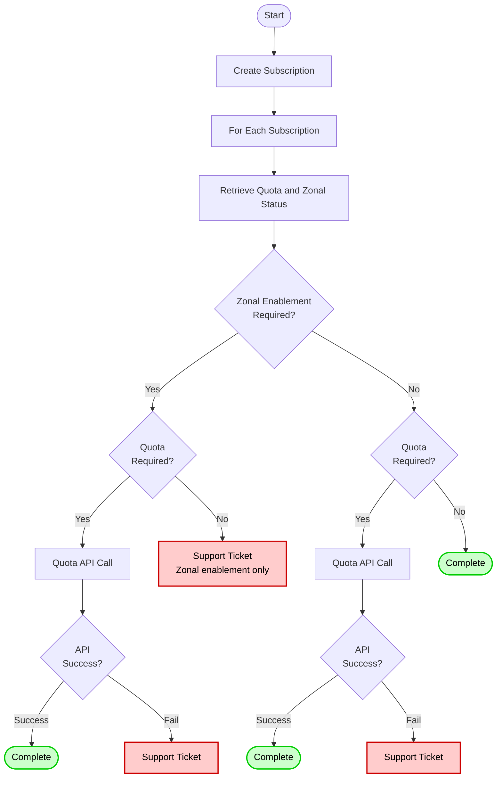
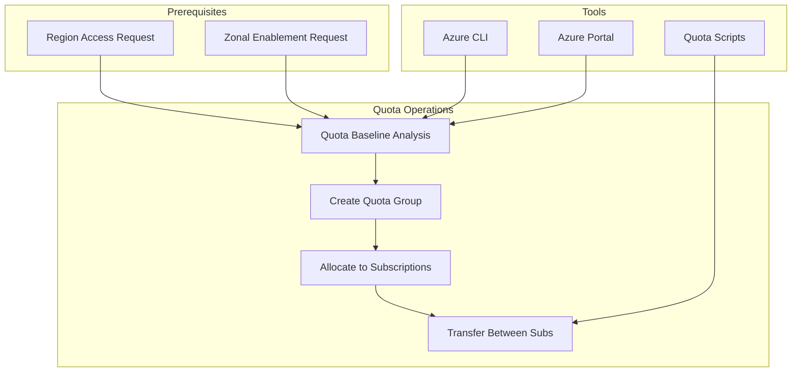

# Slide 13 – access & quota: controls and workflows

## Securing region and zone access

Before allocating quota or creating reservations, ensure the target regions and zones are enabled for your subscription.

### Region access requests

Some Azure regions require explicit enablement. The [region access request process](https://learn.microsoft.com/en-us/troubleshoot/azure/general/region-access-request-process) involves:

1. Submit a support request specifying the region and business justification
2. Wait for approval—timing varies; plan 1-2 weeks minimum for critical launches
3. Verify access by attempting a test deployment

> **Note**: These timelines reflect Microsoft CSU operational experience, not documented Azure SLAs.

### Zonal enablement for restricted VM series

Certain VM series (like NDv4, NCv3, and HBv3) require [zonal enablement requests](https://learn.microsoft.com/en-us/troubleshoot/azure/general/zonal-enablement-request-for-restricted-vm-series) before deployment:

| VM series | Typical use case | Enablement required |
|-----------|-----------------|---------------------|
| ND-series | AI/ML training | Yes |
| NC-series | GPU compute | Yes |
| HB-series | HPC workloads | Yes |
| Standard D/E | General purpose | No |

Submit enablement requests early—they can take longer than standard quota increases.

#### GPU and restricted SKU reality check

GPU quota requests face systematic challenges:
- [Azure for Startups sponsorship subscriptions](https://learn.microsoft.com/en-us/azure/quotas/view-quotas) explicitly exclude many GPU SKUs
- Restricted VM series (ND, NC, HB) require [separate zonal enablement](https://learn.microsoft.com/en-us/troubleshoot/azure/general/zonal-enablement-request-for-restricted-vm-series) beyond standard quota increases
- Approval timelines vary from days to weeks depending on regional capacity and customer profile

For AI/ML workloads: submit GPU quota requests 4-6 weeks before launch, not 1-2 weeks. Have fallback regions identified. Consider [Azure Machine Learning managed compute](https://learn.microsoft.com/en-us/azure/machine-learning/concept-compute-target), which handles quota differently. These timelines reflect Microsoft CSU operational experience.

### Quota baseline analysis

Before requesting increases, establish your current baseline using:

**Azure CLI:**
```bash
az quota show --resource-name "standardDSv3Family" --scope "/subscriptions/{sub-id}/providers/Microsoft.Compute/locations/{region}"
```

**Azure Portal:**
Navigate to **Subscriptions** → **Usage + quotas** to view current limits and usage.

Reference: [Azure CLI quota commands](https://learn.microsoft.com/en-us/cli/azure/quota?view=azure-cli-latest) | [Regional quota requests](https://learn.microsoft.com/en-us/azure/quotas/regional-quota-requests)

### Planning quota transfers

Once quota groups are established, use [quota allocation snapshots](https://learn.microsoft.com/en-us/azure/quotas/transfer-quota-groups#quota-allocation-snapshot) to identify:

- Subscriptions with unused allocated quota
- Subscriptions approaching their limits
- Opportunities to rebalance without requesting increases

---

## Per-subscription quota flow (without quota groups)

Without quota groups, each subscription requires individual quota and zonal enablement checks during vending. This diagram shows where the process can fail:



**Where this breaks down:**
- **Red paths** (support tickets) add 3-10 business days per request
- **Foreach loop** creates N×M complexity (subscriptions × SKUs × regions)
- **Quota API failures** occur when regional capacity is constrained or SKUs are restricted
- **Zonal enablement** for GPU/HPC SKUs requires manual approval before Quota API works

This per-subscription approach is what [quota groups](https://learn.microsoft.com/en-us/azure/quotas/quota-groups) solve by pooling vCPU limits at the management group level.

---

## Concept map: access and quota workflow


