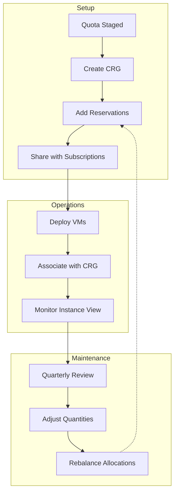

# Slide 14 – reserve: locking supply

## Creating capacity reservation groups

Once quota is staged, create [capacity reservation groups](https://learn.microsoft.com/en-us/azure/virtual-machines/capacity-reservation-overview) to guarantee compute supply. This locks capacity for your exclusive use, ensuring availability during onboarding ramps and demand surges.

### When to create reservations

| Scenario | Timing | Quantity guidance |
|----------|--------|-------------------|
| **Major launch** | 2-4 weeks before go-live | Cover peak expected demand |
| **Steady growth** | As quota is allocated | Match quarterly projections |
| **Regional expansion** | Before first deployment | Minimum viable stamp size |

### Sharing reservations across subscriptions

[Capacity reservation group sharing](https://learn.microsoft.com/en-us/azure/virtual-machines/capacity-reservation-group-share) enables a central procurement model:

1. **Create the CRG** in a central subscription (often a platform or shared services subscription)
2. **Add reservations** for each VM size needed
3. **Share with consumers** – Up to 100 subscriptions can consume shared reservations
4. **Deploy workloads** – Consumer subscriptions associate VMs with the shared CRG

This centralizes cost and governance while distributing deployment authority.

### Monitoring for overallocations

The `instanceView` property on each reservation shows current consumption. [Overallocations](https://learn.microsoft.com/en-us/azure/virtual-machines/capacity-reservation-overallocate) occur when associated VMs exceed the reserved quantity:

```json
{
  "instanceView": {
    "statuses": [...],
    "utilizationInfo": {
      "virtualMachinesAllocated": [...]
    }
  }
}
```

**Remediation options:**
- Increase the reservation quantity
- Reduce the number of associated VMs
- Accept the overallocation (no SLA guarantee for excess)

### Proactive reservation management

- Set calendar reminders for quarterly reservation reviews
- Integrate reservation utilization into FinOps dashboards
- Automate instance view checks as part of deployment pipelines

---

## Concept map: reservation lifecycle


