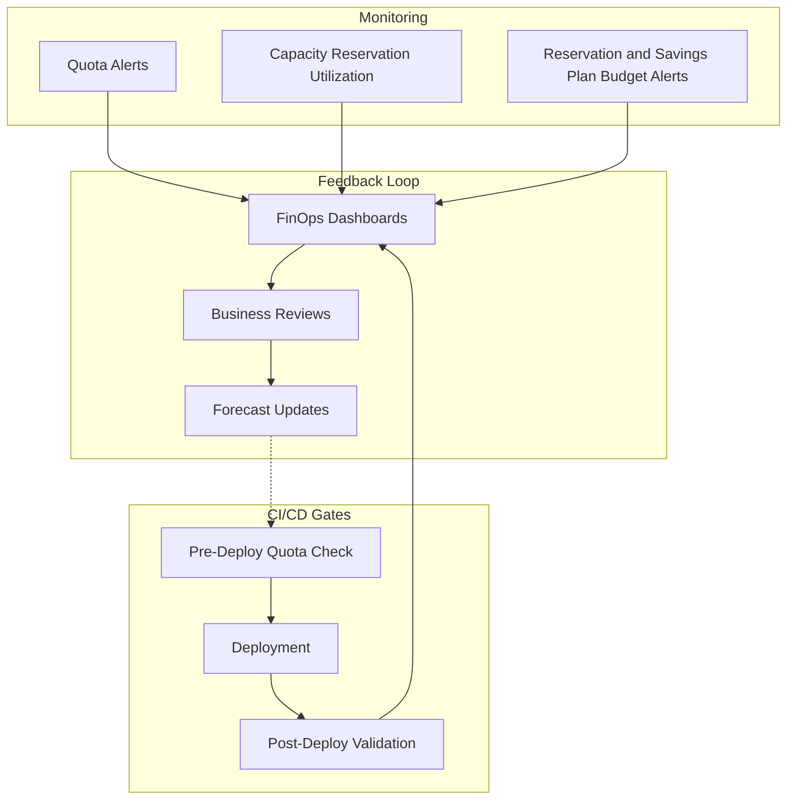

# Slide 15 – govern & ship: monitoring and release gates

## Quota monitoring and alerts

The [quota monitoring and alerting guide](https://learn.microsoft.com/en-us/azure/quotas/how-to-guide-monitoring-alerting) explains how to configure usage alerts in the Azure portal.

### Setting up quota alerts

Navigate to **Quotas** in the Azure portal, then:

1. Select the quota resource to monitor
2. Click **Create alert**
3. Configure thresholds (recommended: 60%, 80%, 90%)
4. Set notification actions (email, webhook, Logic App)

### Recommended alert thresholds

| Threshold | Signal | Recommended action |
|-----------|--------|-------------------|
| **60%** | Early warning | Begin quota increase planning |
| **80%** | Attention required | Submit quota increase request |
| **90%** | Critical | Escalate, pause non-critical deployments |

### Integrating with capacity reservations and pricing commitments

Pair quota alerts with capacity reservation and pricing-commitment monitoring:

- Track capacity reservation `instanceView` for overallocation warnings
- Set budget alerts for Azure reservation and savings plan costs
- Correlate utilization spikes with business events

The [FinOps rate optimization framework](https://learn.microsoft.com/en-us/cloud-computing/finops/framework/optimize/rates#getting-started) provides guidance on aligning these signals.

### CI/CD capacity gates

The [workload supply chain](https://learn.microsoft.com/en-us/azure/well-architected/operational-excellence/workload-supply-chain) model expects capacity checks in deployment pipelines:

**Pre-deployment gate:**
```yaml
- task: AzureCLI@2
  displayName: 'Check quota headroom'
  inputs:
    scriptType: 'bash'
    scriptLocation: 'inlineScript'
    inlineScript: |
      # Query current usage vs. limit
      az quota show --resource-name "standardDSv3Family" \
        --scope "/subscriptions/$SUB_ID/providers/Microsoft.Compute/locations/$REGION"
```

**Post-deployment validation:**
- Verify VMs are associated with capacity reservation groups
- Confirm monitoring alerts are configured for new resources
- Update deployment documentation with capacity consumed

---

## Concept map: govern and ship controls


