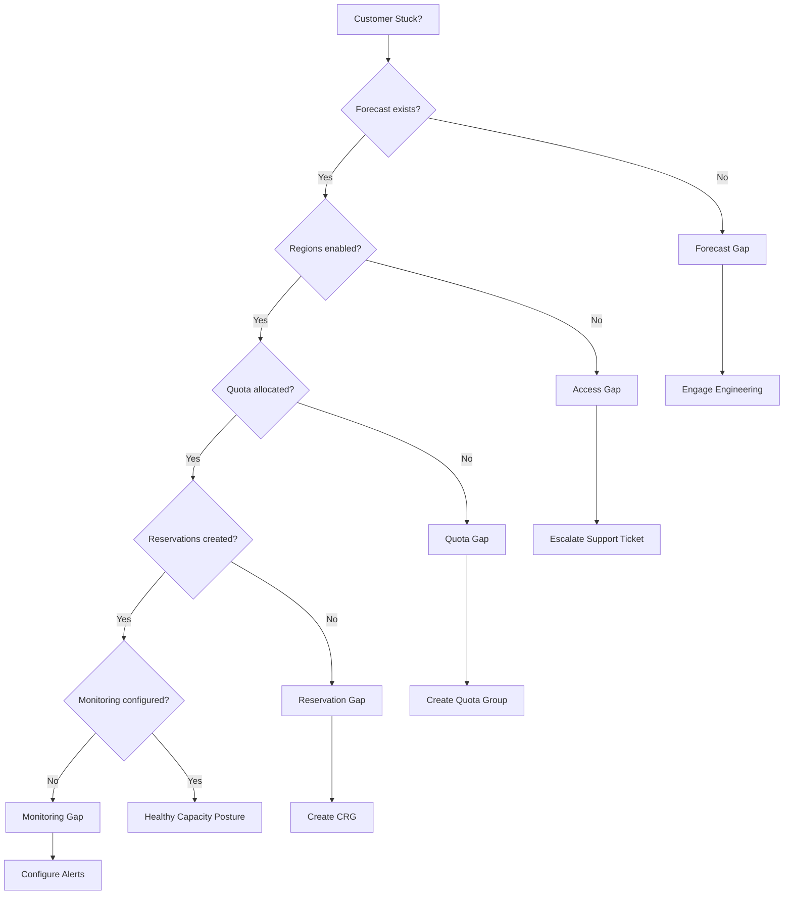

# Slide 16 – spot where customers are stuck

## Diagnosing capacity journey gaps

All personas can identify where customers are stuck by probing each phase of the capacity journey. Use these diagnostic patterns to pinpoint blockers.

### Persona-specific actions when gaps are found

| Gap type | Solution Engineer action | CSM action | CSA action |
|----------|-------------------------|------------|------------|
| **Forecast gap** | Educate on forecasting practices | Coordinate with customer's engineering | Review scale unit model |
| **Access/quota gap** | Explain self-service request process | Assist with ticket escalation | — |
| **Reservation gap** | Explain CRG setup | Coordinate reservation planning | Design reservation strategy |
| **Monitoring gap** | Walk through alert setup | Confirm alerts are configured | Review alerting architecture |

### Forecast gaps

**Symptoms:**
- No documented scale unit or stamp projections
- Utilization telemetry not collected or not reviewed
- Reactive capacity requests driven by deployment failures

**Diagnostic questions:**
- "What data sources inform your capacity forecasts?"
- "How do you translate business growth into compute requirements?"
- "When did you last update your scale unit projections?"

**Escalation path:** Engage engineering resources to instrument workloads and establish forecasting practices per [capacity planning guidance](https://learn.microsoft.com/en-us/azure/well-architected/performance-efficiency/capacity-planning).

### Access and quota blockers

**Symptoms:**
- Support tickets open for days without resolution
- Deployments failing with "region not enabled" errors
- Quota increase requests pending for restricted VM series

**Diagnostic questions:**
- "Which regions and zones are enabled for your subscriptions?"
- "Are there open support tickets for [region access](https://learn.microsoft.com/en-us/troubleshoot/azure/general/region-access-request-process) or [zonal enablement](https://learn.microsoft.com/en-us/troubleshoot/azure/general/zonal-enablement-request-for-restricted-vm-series)?"
- "Who owns quota management, and what's the current request backlog?"

**Escalation path:** Assist with support ticket escalation; ensure requests include complete business justification.

#### Quota ≠ capacity: the SkuNotAvailable problem

Customers often conflate quota (subscription limit) with capacity (physical availability). You can have 1,000 vCPU quota and still fail deployments with `SkuNotAvailable` if datacenter racks are full.

- **Quota**: Your subscription's permission to deploy up to N vCPUs
- **Capacity**: Azure's physical ability to fulfill that deployment in a specific region and zone

[Capacity reservations address availability](https://learn.microsoft.com/en-us/azure/virtual-machines/capacity-reservation-overview) but require the quota to exist first. Capacity constraints are more common in popular regions during high-demand periods (AI/ML launches, seasonal workloads).

When customers report "quota increased but still can't deploy," check for `SkuNotAvailable` errors—this indicates capacity constraint, not quota limit.

### Reservation gaps

**Symptoms:**
- Capacity reservation groups don't exist for production workloads
- [Overallocations](https://learn.microsoft.com/en-us/azure/virtual-machines/capacity-reservation-overallocate) persist in instance view data
- VMs deployed without association to reservation groups

**Diagnostic questions:**
- "Which VMs are associated with capacity reservation groups?"
- "What does the instance view show for your reservations?"
- "How often do you review reservation utilization?"

**Escalation path:** Engage platform engineering to establish reservation governance.

---

## Concept map: diagnostic decision tree

