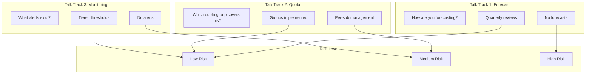

# Slide 17 – talk tracks: qualifying risk

## Conversation anchors for capacity risk assessment

These talk tracks help all personas qualify capacity risk during customer conversations. Each question is anchored in Well-Architected guidance and maps to specific governance controls.

### How each persona uses these talk tracks

| Persona | Context | Goal |
|---------|---------|------|
| **Solution Engineers** | Pre-sales discovery, architecture workshops | Identify governance gaps early; educate on self-service |
| **Customer Success Managers** | Business reviews, check-ins with supported customers | Qualify risk; determine if CSA escalation needed |
| **Customer Success Architects** | Design reviews for supported customers | Validate assumptions; recommend specific controls |

### Forecast maturity

> "How are you forecasting scale units or deployment stamps for the next quarter?"

**What you're probing:**
- Do they have a documented forecasting practice?
- Are forecasts connected to business growth projections?
- Is there a defined scale unit or stamp model?

**Reference:** [Capacity planning](https://learn.microsoft.com/en-us/azure/well-architected/performance-efficiency/capacity-planning)

**Green flags:** Quarterly forecasts tied to scale units, utilization telemetry reviewed regularly
**Red flags:** No forecasts, reactive capacity requests, "we'll figure it out when we need it"

### Quota governance

> "Which quota group covers this subscription and what shareable headroom remains?"

**What you're probing:**
- Have they implemented [quota groups](https://learn.microsoft.com/en-us/azure/quotas/quota-groups)?
- Do they know their current utilization?
- Is there unused quota that could be reallocated?

**Reference:** [Quota allocation snapshots](https://learn.microsoft.com/en-us/azure/quotas/transfer-quota-groups#quota-allocation-snapshot)

**Green flags:** Quota groups in place, regular utilization reviews, documented headroom
**Red flags:** Per-subscription quota management, no visibility into aggregate usage

### Monitoring discipline

> "Which alerts tell you we are 60 days from a capacity crunch?"

**What you're probing:**
- Have they configured [quota monitoring and alerting](https://learn.microsoft.com/en-us/azure/quotas/how-to-guide-monitoring-alerting)?
- Are there defined thresholds for early warning?
- Who receives alerts and what's the response process?

**Green flags:** Tiered alerts at 60/80/90%, defined escalation process, regular review cadence
**Red flags:** No alerts, alerts going to unmonitored inbox, no defined response process

---

## Concept map: risk qualification framework

