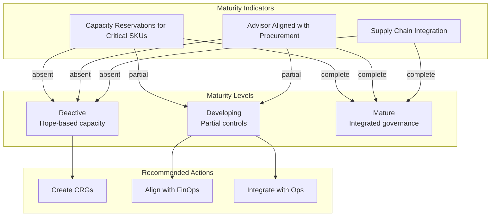

# Slide 18 – talk tracks: assessing maturity

## Assessing capacity governance maturity

These talk tracks help all personas evaluate whether customers have mature capacity governance practices in place before major initiatives.

### Persona context for maturity assessment

| Persona | When to assess | Outcome |
|---------|---------------|---------|
| **Solution Engineers** | During pre-sales discovery | Identify education needs; set realistic expectations for go-live |
| **Customer Success Managers** | Before major launches, quarterly reviews | Determine risk level; escalate to CSA if gaps are critical |
| **Customer Success Architects** | During design reviews | Validate architecture; recommend specific controls |

### Reservation readiness

> "Do capacity reservations exist for your mission-critical SKUs?"

**What you're probing:**
- Have they identified which VMs are mission-critical?
- Are [capacity reservations](https://learn.microsoft.com/en-us/azure/virtual-machines/capacity-reservation-overview) in place for those SKUs?
- Is there a process for reviewing capacity reservation coverage before launches?

**Mature response:** "Yes, we have CRGs for our tier-1 workloads covering D-series and E-series VMs across our primary regions and zones."

**Immature response:** "We haven't set up any reservations—we deploy without confirmed capacity coverage."

### Advisor alignment

> "How do you correlate Advisor recommendations with your procurement cadences?"

**What you're probing:**
- Do they review [Azure Advisor](https://learn.microsoft.com/en-us/azure/advisor/advisor-overview) recommendations regularly?
- Are savings-plan and Azure reservation recommendations aligned with capacity plans?
- Is there a process to filter signal from noise in Advisor?

**Reference:** [FinOps rate optimization](https://learn.microsoft.com/en-us/cloud-computing/finops/framework/optimize/rates#getting-started)

**Mature response:** "We review Advisor weekly and correlate recommendations with our quarterly procurement planning."

**Immature response:** "We see the recommendations but don't have time to act on them."

### Supply chain integration

> "How do you map quota, capacity reservation, and budget data to your internal supply chain reviews?"

**What you're probing:**
- Is capacity governance integrated with their operations model?
- Do they follow [workload supply chain](https://learn.microsoft.com/en-us/azure/well-architected/operational-excellence/workload-supply-chain) practices?
- Are there defined touchpoints between FinOps, engineering, and business teams?

**Mature response:** "Capacity data feeds into our monthly supply chain review alongside procurement and release planning."

**Immature response:** "Those are managed by different teams and they do not coordinate their decisions."

---

## Concept map: maturity assessment

