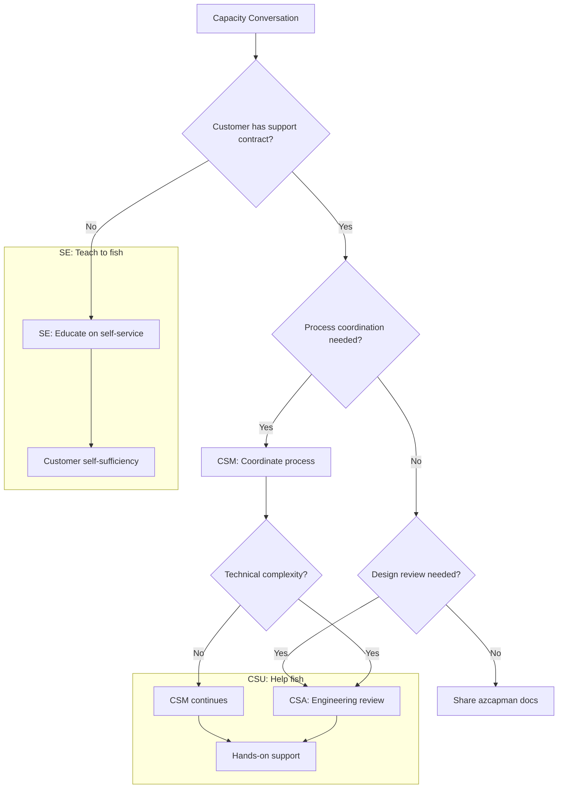

# Slide 19 – partner handoffs and tooling

## Persona-based handoff model

Different personas engage with capacity governance in distinct ways. Understanding these boundaries ensures customers get the right help at the right time.

### Solution Engineers (pre-sales): teach to fish

SEs educate customers on capacity governance during sales cycles so they can manage capacity independently:

| SE focus | Deliverable | Outcome |
|----------|-------------|---------|
| **Education** | Walk through azcapman guides | Customer understands the capacity journey |
| **Architecture patterns** | Recommend scale units and quota groups | Customer designs for capacity from the start |
| **Self-serve resources** | Share documentation and CLI commands | Customer avoids future support tickets |

**SE handoff to CSU:** When a customer has a support contract and needs hands-on assistance with the capacity process, transition to CSM/CSA.

### Customer Success Managers (CSU): coordinate the process

CSMs work with supported customers to coordinate capacity governance activities:

| CSM focus | Activity | Outcome |
|-----------|----------|---------|
| **Process coordination** | Track progress through capacity journey phases | Customer stays on track |
| **Risk identification** | Use talk tracks to qualify capacity gaps | Early warning on blockers |
| **Escalation management** | Route complex issues to CSAs | Right expertise engaged |

**CSAM handoff to CSA:** When capacity conversations require engineering design reviews—forecast validation, architecture changes, or complex quota strategies.

#### Objective complexity rubric for CSAM→CSA escalation

These measurable criteria help you decide who leads:

| Scenario | Owner | CSA Involvement |
|----------|-------|-----------------|
| Single subscription, single region, <10 VM SKUs | CSAM coordinates | Consult available |
| Multi-subscription OR multi-region OR >10 SKUs | CSA leads design | CSAM coordinates execution |
| Quota groups >500 vCPU OR capacity spend >$50K/month | CSA required | CSAM tracks milestones |
| GPU/restricted SKU capacity planning | CSA required | SE provides initial education |

> **Role clarity: coordinate vs execute**
>
> - **CSAM coordinates**: Schedules meetings, tracks milestones, directs customer engineers, verifies completion. Doesn't execute technical configuration.
> - **SE educates**: Explains concepts, shares documentation, demonstrates portal workflows. Doesn't access customer environments.
> - **CSA executes**: Performs hands-on design validation, reviews architecture, provides specific configuration guidance. Has delegated access for supported customers.

### Customer Success Architects (CSU): engineering design reviews

CSAs provide technical depth for supported customers with complex capacity needs:

| Trigger | Example scenario | CSA value-add |
|---------|-----------------|---------------|
| **Forecast assumptions** | Customer's scale unit model needs validation | Architecture review of resource composition |
| **Architecture changes** | Migration to new VM families or regions | Capacity impact assessment |
| **Complex quota strategies** | Multi-region quota groups with shared reservations | Design review per [mission-critical guidance](https://learn.microsoft.com/en-us/azure/well-architected/mission-critical/application-design#scale-unit-architecture) |

#### Engagement lifecycle matrix

Support contracts determine access to CSU engagement, not exclusivity. Pre-sales customers with contracts get SE education PLUS CSU planning:

| | No Support Contract | Has Support Contract |
|---|---|---|
| **Pre-sales** | SE educates, shares aka.ms/azcapman | SE educates + CSAM plans post-sale engagement |
| **Post-sales** | SE re-engages if customer returns | CSAM coordinates, escalates to CSA for complex design |

**Note:** Support contracts unlock CSU (CSAM/CSA) access, they don't replace SE education. Pre-sales customers with support contracts receive SE education now and CSU planning for post-sale handoff.

### Self-serve resources (all personas)

Share these resources with customers regardless of support status:

| Resource | URL | Use case |
|----------|-----|----------|
| **azcapman guides** | [aka.ms/azcapman](https://aka.ms/azcapman) | Complete capacity governance guide |
| **Quota groups docs** | [learn.microsoft.com](https://learn.microsoft.com/en-us/azure/quotas/quota-groups) | Quota pooling mechanics |
| **Capacity reservations** | [learn.microsoft.com](https://learn.microsoft.com/en-us/azure/virtual-machines/capacity-reservation-overview) | Reservation setup and sharing |
| **Azure CLI quota** | [learn.microsoft.com](https://learn.microsoft.com/en-us/cli/azure/quota?view=azure-cli-latest) | Command-line quota operations |
| **Monitoring guide** | [learn.microsoft.com](https://learn.microsoft.com/en-us/azure/quotas/how-to-guide-monitoring-alerting) | Alert configuration |

---

## Concept map: handoff decision tree

