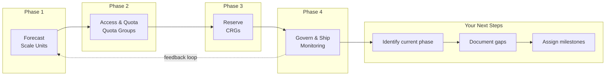

# Slide 20 – closing, next steps, and questions

## Session recap

You've now covered the four-phase capacity journey and the Azure controls supporting each phase:

| Phase | Key control | Reference |
|-------|-------------|-----------|
| **Forecast** | Scale unit projections | [Capacity planning](https://learn.microsoft.com/en-us/azure/well-architected/performance-efficiency/capacity-planning) |
| **Access & Quota** | Quota groups | [Quota groups](https://learn.microsoft.com/en-us/azure/quotas/quota-groups) |
| **Reserve** | Capacity reservation groups | [Capacity reservations](https://learn.microsoft.com/en-us/azure/virtual-machines/capacity-reservation-overview) |
| **Govern & Ship** | Monitoring and CI/CD gates | [Workload supply chain](https://learn.microsoft.com/en-us/azure/well-architected/operational-excellence/workload-supply-chain) |

## Assigned follow-ups

Before your next customer engagement, complete these actions:

### For Solution Engineers (pre-sales):

1. **Share self-serve resources** – Point customers to [azcapman](https://aka.ms/azcapman) during architecture discussions
2. **Educate on capacity journey** – Walk through the four phases so customers understand what to plan for
3. **Identify governance gaps** – Use talk tracks to surface issues before they become support tickets

### For Customer Success Managers (CSU):

1. **Identify current phase** – Where is each strategic ISV in the capacity journey?
2. **Document gaps** – What controls are missing or incomplete?
3. **Assign next milestone** – What's the specific next step and who owns it?
4. **Schedule quota group reviews** – Block time to review quota utilization with platform teams

### For Customer Success Architects (CSU):

1. **Confirm reservation checks** – Verify that reservation utilization is being monitored for supported customers
2. **Review escalation queue** – Are there pending design reviews for complex capacity strategies?
3. **Update patterns library** – Document successful capacity governance implementations

## Reference checklist

Bookmark these resources for quick access during customer conversations:

- [ ] [aka.ms/azcapman](https://aka.ms/azcapman) – Capacity governance guides
- [ ] [Capacity planning](https://learn.microsoft.com/en-us/azure/well-architected/performance-efficiency/capacity-planning) – Well-Architected guidance
- [ ] [Quota groups](https://learn.microsoft.com/en-us/azure/quotas/quota-groups) – Pooled quota management
- [ ] [Capacity reservations](https://learn.microsoft.com/en-us/azure/virtual-machines/capacity-reservation-overview) – Priority compute
- [ ] [Monitoring and alerting](https://learn.microsoft.com/en-us/azure/quotas/how-to-guide-monitoring-alerting) – Usage alerts

## Questions and feedback

Thank you for attending. For questions or feedback:

- Reference the [azcapman guides](https://aka.ms/azcapman) for self-serve answers
- Engage your CSA for architecture design reviews
- Share feedback to improve this training for future sessions

---

## Concept map: capacity journey complete

